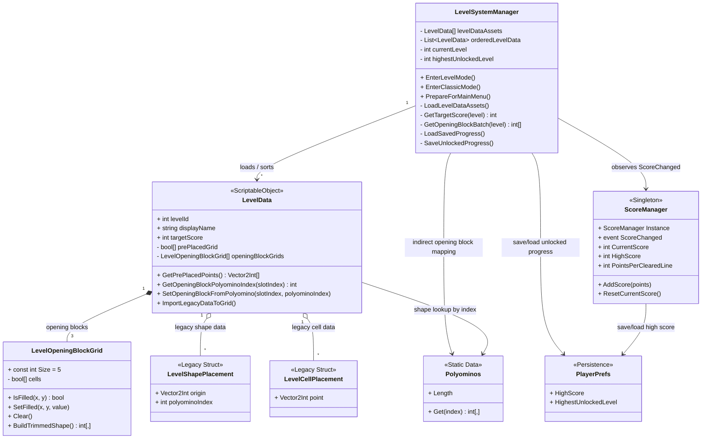

# Game Data Class Diagram

Ghi chu:
- Project nay khong co database theo kieu SQL/NoSQL.
- Lop data hien tai duoc luu theo 2 tang:
  - `LevelData` (`ScriptableObject`) cho du lieu cau hinh level.
  - `PlayerPrefs` cho du lieu persistence don gian nhu `HighScore` va `HighestUnlockedLevel`.

Tom tat:
- `LevelData` la nguon du lieu level chinh: muc tieu diem, o khoa san, va 3 opening blocks dau tien.
- `LevelSystemManager` la lop doc/quan ly data level va data progress.
- `ScoreManager` la lop quan ly runtime score va persistence high score.
- `PlayerPrefs` dong vai tro "database don gian" cua game cho du lieu can giu sau khi tat game.
