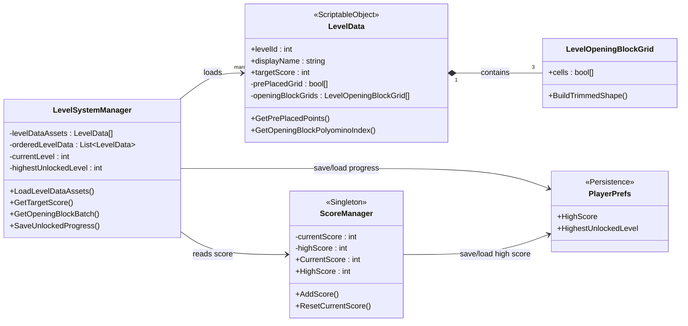

# Simple Game Data Class Diagram

Phien ban rut gon, tap trung vao cac lop du lieu chinh va persistence cua game.

Tom tat ngan:
- `LevelData` luu cau hinh tung level.
- `LevelOpeningBlockGrid` luu hinh dang 3 block mo dau.
- `LevelSystemManager` doc level data va quan ly tien trinh unlock level.
- `ScoreManager` quan ly diem hien tai va high score.
- `PlayerPrefs` dong vai tro bo nho luu du lieu don gian cua game.
